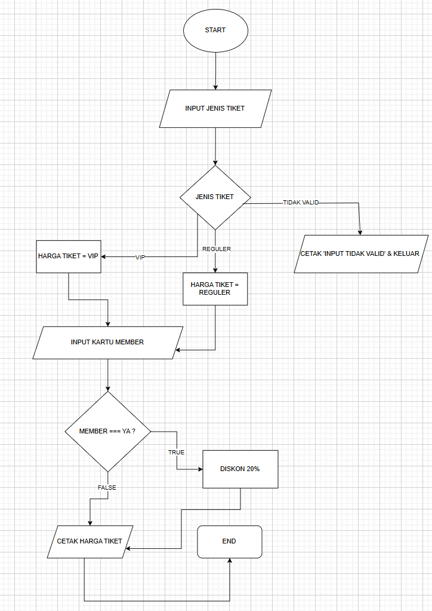

## Nama : Aldi Rismandayana
## Kelas : TI.24.A1

# LABPY02

## Program Diskon Harga tiket
Program ini adalah program kalkulator harga tiket yang menghitung total biaya tiket berdasarkan dua faktor utama: tipe tiket (reguler atau VIP) dan status keanggotaan (apakah pengguna memiliki kartu member atau tidak)
## Deskripsi Program
Program ini dibuat menggunakan bahasa python dengan fitur:

1. Input dan Output: input(): Untuk menerima masukan dari pengguna. print(): Untuk menampilkan output ke konsol.
2. Tipe Data: String: Menyimpan tipe tiket dan status member sebagai teks. Integer: Menggunakan harga tiket sebagai angka.
3. Pengkondisian: if, elif, dan else: Untuk menentukan harga tiket berdasarkan input pengguna dan memberikan diskon jika pengguna adalah anggota.
4. Operasi Aritmetika: Menghitung total harga dengan mengalikan harga tiket dan mengurangi 20% jika pengguna memiliki kartu member.
5. Fungsi lower(): Untuk mengubah input menjadi huruf kecil, sehingga memudahkan validasi.
Penggunaan List: Menggunakan in untuk memeriksa validitas tipe tiket dalam list yang berisi "reguler" dan "vip"

## Code Program Diskon Tiket
```python
def hitung_harga_tiket(tipe_tiket, member):
    harga_reguler = 50000
    harga_vip = 100000
    diskon = 0.2

    if tipe_tiket.lower() == 'reguler':
        harga = harga_reguler
    elif tipe_tiket.lower() == 'vip':
        harga = harga_vip
    else:
        return "Tipe tiket tidak valid."

    if member:
        harga *= (1 - diskon)

    return f"Total harga yang harus dibayar oleh anda adalah: Rp{int(harga)}"

# Input dari user
tipe_tiket = input("Masukkan jenis tiket anda (reguler/vip): ")
member = input("Apakah Anda memiliki kartu member? (ya/tidak): ").lower() == 'ya'

print(hitung_harga_tiket(tipe_tiket, member))
```
## Output Program 
````markdown
Masukkan jenis tiket anda (reguler/vip): vip
Apakah Anda memiliki kartu member? (ya/tidak): ya
Total harga yang harus dibayar oleh anda adalah: Rp80000

Masukkan jenis tiket anda (reguler/vip): vip
Apakah Anda memiliki kartu member? (ya/tidak): tidak
Total harga yang harus dibayar oleh anda adalah: Rp100000

Masukkan jenis tiket anda (reguler/vip): reguler
Apakah Anda memiliki kartu member? (ya/tidak): ya
Total harga yang harus dibayar oleh anda adalah: Rp40000

Masukkan jenis tiket anda (reguler/vip): reguler
Apakah Anda memiliki kartu member? (ya/tidak): tidak
Total harga yang harus dibayar oleh anda adalah: Rp50000
````
## Cara Kerja Program 
- Mulai (start)
- Input Tipe Tiket : pengguna memasukan jenis tiket, yaitu berupa REGULER dan VIP
- Program memeriksa pilihan tiket :
    -     Jika pengguna memilih "reguler", harga tiket di-set ke harga reguler.
    -     Jika memilih "VIP", harga tiket di-set ke harga VIP.
    -     Jika pilihan tidak valid, program memberi tahu pengguna dan berhenti.
- input Status Member :
  Program kemudian bertanya apakah pengguna memiliki kartu member
  dengan jawaban "ya" atau "tidak". Jawaban ini juga diubah menjadi huruf kecil.
- Program memeriksa apakah pengguna adalah member :
     -      Jika "ya", total harga dihitung dengan diskon 20%.
     -     Jika "tidak", total harga sama dengan harga tiket yang dipilih.
     -     Akhir (End) : proses selesai

## Flowchart Diskon Tiket
  


## Program Kalkulator Sederhana
Program kalkulator sederhana untuk menghitung inputan dari user.

## Deskripsi Program
Program kalkulator sederhana yang mampu melakukan operasi dasar matematika dengan dua bilangan, user bisa memilih operasi yang ingin mereka lakukak (+,-.x.).

## Code Program Kalkulator Sederhana
````python
def kalkulator(angka1,angka2,operator) :
    if operator == '+':
        return angka1 + angka2
    elif operator == '-':
        return angka1 - angka2 
    elif operator == '*':
        return angka1 * angka2
    elif operator == '/':
        return angka1 / angka2
    else:
        print("Input tidak valid")
        exit()

angka1 = int(input('masukan angka pertama :'))
angka2 = int(input('masukan angka kedua :'))
operator = input("masukan operator ('+','-','*','/')")

hasil = kalkulator(angka1, angka2, operator)
print(f"Hasilnya Adalah : {hasil}")
````
## Output Program
```markdown
masukan angka pertama :345
masukan angka kedua :897
masukan operator ('+','-','*','/')*
Hasilnya Adalah : 309465
```

## Flowchart Kalkulator
  


## Cara Kerja 
1. Program meminta input angka pertama
2. Program meminta input angka kedua
3. Program meminta input operator matematika
4. Fungsi kalkulator() memproses input sesuai operator
5. Menampilkan hasil perhitungan
